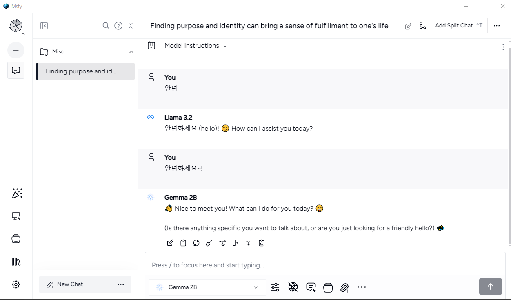
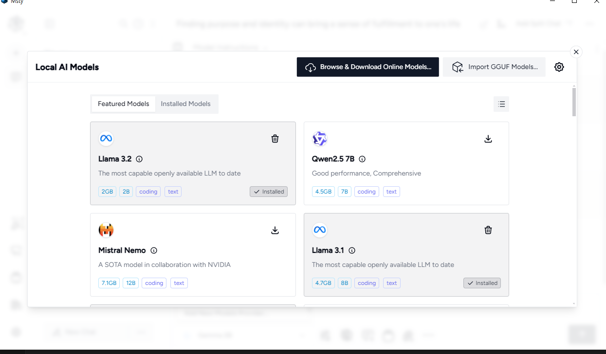
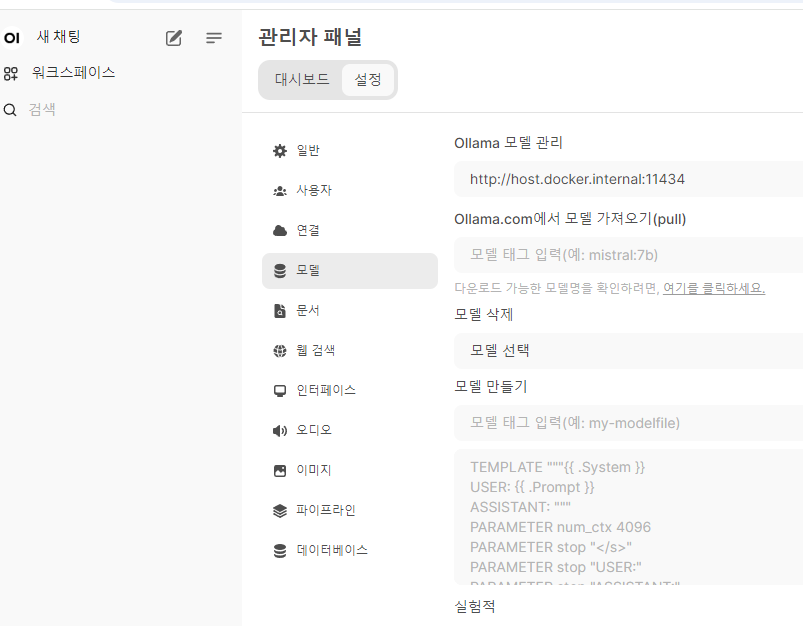
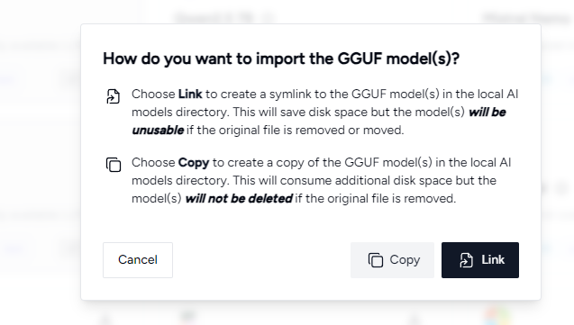
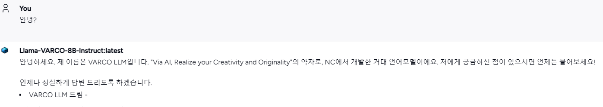

# LLM 학습

최근 AI 관련 학습을 하다보니, API를 통해서 클라우드에 데이터 전송이 보안적으로 문제가 될 수 있는 부분들도 많겠다고 생각을 했다.

그래서 로컬 환경에서 설치 및 테스트를 해보고 싶어서 시작했다.

## Msty 설치 및 실행

다양한 제품이 있었다. LMStudio, ollama, Msty, Llama.cpp 등등...

여기서 팀에서 공유된 Msty를 설치 및 실행했다.

[Msty](https://msty.app/)에 접속해서 다운로드 후 실행하면 끝... 너무나도 간단했다.



자유롭게 Local AI 모델을 추가할 수도 있다.



## Open WebUI (Formerly Ollama WebUI) 👋

로컬에서 Web UI로 사용할 수 있는 LLM로 또 다른 Web UI를 테스트 했다.

[Download Ollama](https://ollama.com/download)에서 다운로드.

Docker를 이용하여 다음과 같이 실행.

```bash
docker run -d -p 3000:8080 --add-host=host.docker.internal:host-gateway -v open-webui:/app/backend/data --name open-webui --restart always ghcr.io/open-webui/open-webui:main
```

설치 후 모델은 관리가 패널 > 모델 > Ollama.com에서 모델 가져오기(pull)를 통해서 설치할 수 있었다.



## GGUF 파일 생성하기

Msty에는 GGUF 모델을 import하는 기능이 있다.

회사에서 [NCSOFT/Llama-VARCO-8B-Instruct](https://huggingface.co/NCSOFT/Llama-VARCO-8B-Instruct/tree/main)를 오픈했다.

로컬에 설치하고 싶어서 확인했더니 GGUF 파일이 없어서 해당 파일을 생성해봤다.

처음에는 HuggingFace를 이용해서 간단하게 변경하고 싶었으나 `Llama-VARCO-8B-Instruct`가 LLaMA 3 베이스여서 직접 gguf 모델을 생성하기로 했다.

### 생성 과정

#### Downloading a HuggingFace model

```python
pip install huggingface_hub
```

`download.py` 파일 생성

```python
# download.py 파일
from huggingface_hub import snapshot_download
model_id="NCSOFT/Llama-VARCO-8B-Instruct"
snapshot_download(repo_id=model_id, local_dir="llama-varco",
                  local_dir_use_symlinks=False, revision="main")
```

`download.py` 파일 실행

```python
python download.py
```

`ls -lash llama-varco` 다운로드 확인

#### Converting the model

`llama.cpp` clone

```
git clone https://github.com/ggerganov/llama.cpp.git
```

파이썬 의존성 설치

```python
pip install -r llama.cpp/requirements.txt
```

튜토리얼에는 `llama.cpp/convert.py`을 실행시켰지만, Llama 3를 변환시키기 위해서 `convert_hf_to_gguf.py`을 적용.

```python
python llama.cpp/convert_hf_to_gguf.py llama-varco --outfile Llama-VARCO-8B-Instruct.gguf --outtype q8_0
```

설치 과정에서 오류가 발생. (`WARNING: The BPE pre-tokenizer was not recognized! .... chkhsh: xxxxx`)

`convert_hf_to_gguf.py`파일에 `get_vocab_base_pre` 함수 내에 `llama-bpe` 케이스 추가

```python
 if chkhsh == "xxxxx":
    # ref: https://huggingface.co/meta-llama/Meta-Llama-3-8B
    res = "llama-bpe"
```

생성 완료.

### GGUF 파일 적용하기.

생성된 gguf를 로컬 AI에 Import



실행.



## 참고자료

- [Quick Start with Docker](https://github.com/open-webui/open-webui?tab=readme-ov-file#quick-start-with-docker-)를 진행헀다.
- [Tutorial: How to convert HuggingFace model to GGUF format](https://github.com/ggerganov/llama.cpp/discussions/2948)
